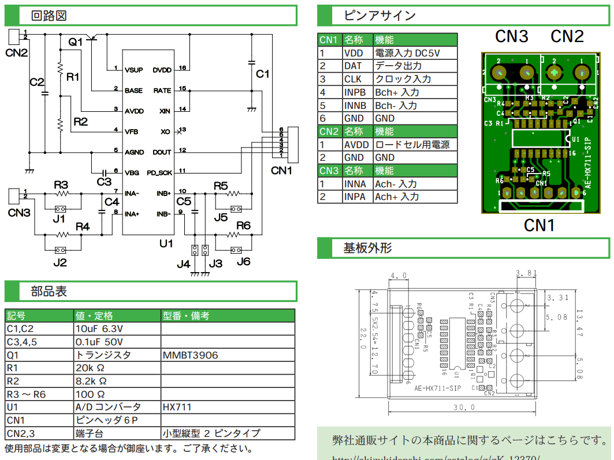

# 作業指示書

## 24bitA/D変換基板

### 使用部品

|部品|個数|備考|
|:--:|:--:|:--:|
|各種抵抗|任意||
|各種コンデンサ|任意||
|[HX711](https://akizukidenshi.com/catalog/g/g112473/)|6|ICのみ購入|
|USB type-A メス|4|A/D変換基板接続用|

### 基板設計
HX711を表面実装する。
データレートを80SPSにするためにRATEピンはHIGHにする。  

秋月で売られているA/D変換基板を参考に、ほぼパクる。使用部品も書いてあるので秋月で部品選定。  

USB type-Aは制御基板と同様に使用する。
|ピン|+5V|D-|D+|GND|
|:--:|:--:|:--:|:--:|:--:|
|用途|VDD|SLK|DOUT|GND|
|図中CN1|1|2|3|6|

ロードセルのリード線はとても細いです。  

配線は次のようにする。  
|基板|AVDD|GND|INNA|INPA
|:--:|:--:|:--:|:--:|:--:|
|ロードセル|EXC+(赤)|EXC-(黒)|SIG-(白)|SIG+(緑)|

基板にリード線を通す穴（*Φ*2くらい）を4つ開けて、ハンダに無理な負荷がかからないようにする（下図）。ブリッジしたら嫌なので、それなりにパッド同士は離す。  

A/D変換基板は4つ製作する。
