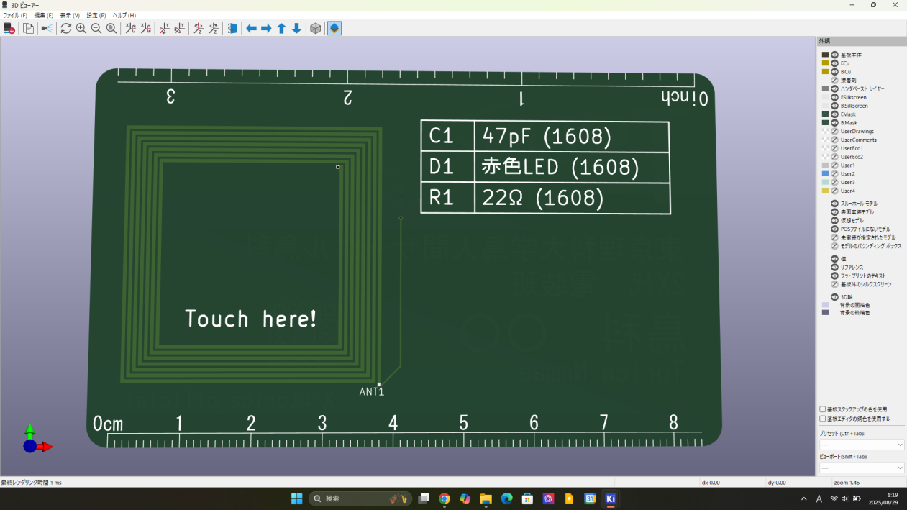

# 作業指示書

## 基板名刺 (PCB Contact Card)

### 要件
- 自身の氏名と所属をシルクスクリーンに印字すること。
- 基板のパターンでコイルを作り、無線でLEDに給電できるようにすること。

### 使用部品
- 1枚あたりの使用部品

|部品|個数|備考|
|:--:|:--:|:--:|
|チップLED|1|サイズは1608 赤色LED|
|チップ抵抗|1|サイズは1608 22Ω|
|チップコンデンサ|1|サイズは1608 47pF|
|PCB基板|1|設計・発注する|

### 基板設計について
- コイル(3μH)
  - フットプリントをダウンロードする。（リポジトリ 26th_PCB_Contact_Card を参照）
- シルクスクリーン（ロゴや名前など）は各自いい感じに！
