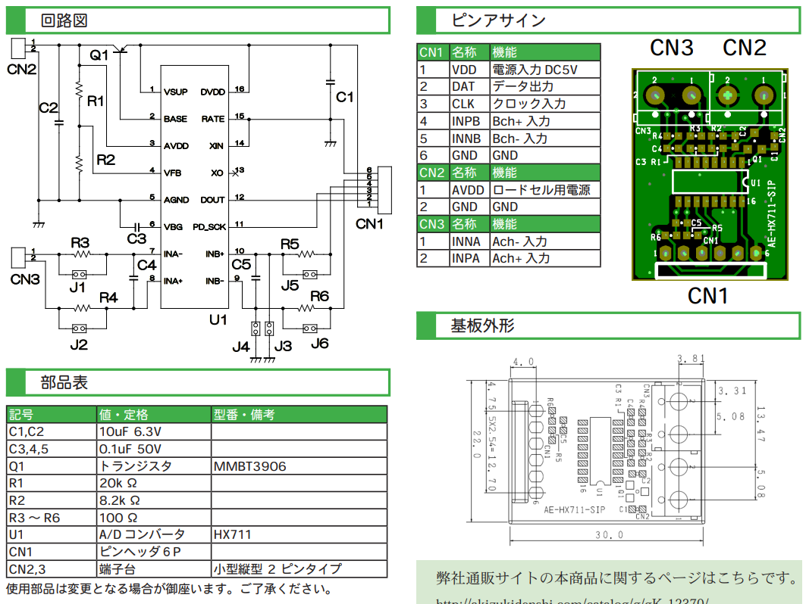

# 作業指示書

## TORICA Sim 制御装置 (TORICA Sim Controller)

### 要件
- 電装班員ではない人間が扱っても壊れにくい仕組みにすること。
- PC↔マイコン間はUSB type-Cで接続できるようにすること。
- マイコン↔ロードセル間はUSB type-Aで接続できるようにすること。
- 静電気の多い環境に置かれる可能性を考慮し、密閉型の筐体を3Dプリンタで造形する。

### 制御装置の基板設計
使用するマイコンはSeeed XIAO RP2040とし、これを表面実装する。以下にピン配置を示す。  

ピンの用途は以下のようにする。
|ピン|用途|
|:--:|:--:|
|A0, A1|ラダーの可変抵抗分圧読み取り用|
|D2|リセットスイッチ|
|D3, D5, D7, D9|SLK クロック|
|D4, D6, D8, D10|DOUT データ出力|

A/D変換基盤との接続は以下のようにする。  

|ピン|+5V|D-|D+|GND|
|:--:|:--:|:--:|:--:|:--:|
|用途|VDD|SLK|DOUT|GND|

3.5mmステレオミニプラグ／ジャックを用いて、ラダーを接続する。　　

それに伴って、XT↔ステレオミニプラグ変換基板も製作する。

### 24bitA/D変換基板の設計
HX711を表面実装する。
データレートを80SPSにするためにRATEピンはHIGHにする。  

秋月で売られているA/D変換基板を参考に、ほぼパクる。使用部品も書いてあるので秋月で部品選定。  

USB type-Aは制御基板と同様に使用する。
|ピン|+5V|D-|D+|GND|
|:--:|:--:|:--:|:--:|:--:|
|用途|VDD|SLK|DOUT|GND|
|図中CN1|1|2|3|6|

ロードセルのリード線はとても細いです。  

配線は次のようにする。  
|基板|AVDD|GND|INNA|INPA
|:--:|:--:|:--:|:--:|:--:|
|ロードセル|EXC+(赤)|EXC-(黒)|SIG-(白)|SIG+(緑)|

基板にリード線を通す穴（*Φ*2くらい）を4つ開けて、ハンダに無理な負荷がかからないようにする（下図）。ブリッジしたら嫌なので、それなりにパッド同士は離す。  

A/D変換基板は4つ製作する。